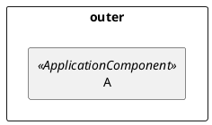
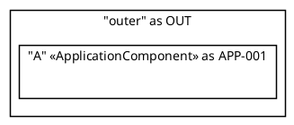
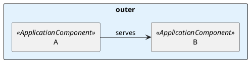

# PlantUML Bug Reports

Confirmed bugs found during ENG-001 diagram authoring (2026-04-04).
PlantUML version at time of discovery: **1.2025.2** (JAR) / **1.2025.10** (VS Code extension).

Each entry includes reproduction steps, the Java exception if available, workaround, and a note on whether a bug report has been filed upstream.

---

## PB-001 — `IndexOutOfBoundsException` when `together { }` is nested inside `rectangle { }`

**Severity:** Hard crash — diagram produces an error SVG with no useful content.

**Affected versions:** Confirmed 1.2025.2 and 1.2025.10.

**Symptom:**

```
Error java.lang.IndexOutOfBoundsException: Index -1 out of bounds for length 0
  at net.atmp.CucaDiagram.currentTogether(CucaDiagram.java:188)
  at net.atmp.CucaDiagram.gotoTogether(CucaDiagram.java:336)
  at net.sourceforge.plantuml.descdiagram.command.CommandTogether.executeArg(CommandTogether.java:66)
```

**Minimal reproduction:**



**Root cause (inferred):** PlantUML's `together` command calls `currentTogether()` which pops from an internal stack. When `together` appears inside a `rectangle { }` group, the stack is empty (the `rectangle` context is different), producing an index-out-of-bounds.

**Workaround:** List elements flat inside the grouping rectangle — no `together` blocks inside `rectangle { }`. Use `together { }` only at the top level when layout hints are needed.

**Upstream report filed:** Not yet. Reproduction case and full stack trace above. File at: https://plantuml.com/qa

---

## PB-002 — Hyphenated element aliases inside `rectangle { }` groups cause syntax error

**Severity:** Hard failure — diagram produces an error SVG.

**Affected versions:** Confirmed 1.2025.2 and 1.2025.10.

**Symptom:**

```
Error line N in file: diagram.puml
Syntax Error? (Assumed diagram type: class)
```

**Minimal reproduction:**



Note: `APP-001` at the **top level** (outside any group) also fails in connection syntax:

```plantuml
@startuml
APP-001 --> APP-016 : test   ' fails — hyphen treated as arithmetic
@enduml
```

**Root cause:** PlantUML's lexer treats `-` as subtraction in some contexts. Inside a `rectangle { }` body, the `as APP-001` clause is misinterpreted. At the top level, `APP-001 --> APP-016` tokenises as `(APP) - (001) --> (APP) - (016)` rather than element references.

**Workaround:** Use underscores in all element aliases (`APP_001`). The hyphenated form is fine only in label strings and frontmatter data fields.

**Upstream report filed:** Not yet. File at: https://plantuml.com/qa (combine with PB-001 for context).

---

## PB-003 — `left to right direction` causes element declaration failure inside grouping rectangles

**Severity:** Hard failure — diagram produces an error SVG.

**Affected versions:** Confirmed 1.2025.2.

**Symptom:**

```
Error line N in file: diagram.puml
Syntax Error? (Assumed diagram type: class)
```

**Minimal reproduction:**



Note: removing `left to right direction` fixes this diagram.

**Root cause (inferred):** `left to right direction` triggers a different parser path for rectangle diagrams that fails to handle nested element declarations in grouping contexts.

**Workaround:** Use `skinparam rankdir LR` instead of `left to right direction`. Empirically confirmed to produce the same layout orientation without the parser failure.

```plantuml
' INSTEAD OF: left to right direction
skinparam rankdir LR
```

**Upstream report filed:** Not yet. File at: https://plantuml.com/qa

---

## PB-004 — Inline skinparam block format not parsed

**Severity:** Renders wrong (no colour applied, no error).

**Affected versions:** Confirmed 1.2025.2 and 1.2025.10.

**Symptom:** No error, but skinparam settings are silently ignored.

**Failing format:**

```plantuml
skinparam rectangle<<ApplicationComponent>> { BackgroundColor #CCF2FF; BorderColor #0078A0 }
```

**Workaround:** Use multi-line format:

```plantuml
skinparam rectangle<<ApplicationComponent>> {
  BackgroundColor #CCF2FF
  BorderColor #0078A0
}
```

**Upstream report filed:** Not yet. May be intentional (not documented either way).

---

## Filing upstream bug reports

1. Reproduce with a minimal `.puml` file (as above).
2. Note PlantUML version from `java -jar plantuml.jar -version`.
3. Post to https://plantuml.com/qa with the reproduction case, expected behaviour, and actual output / stack trace.
4. Update this file with the QA post URL once filed.
